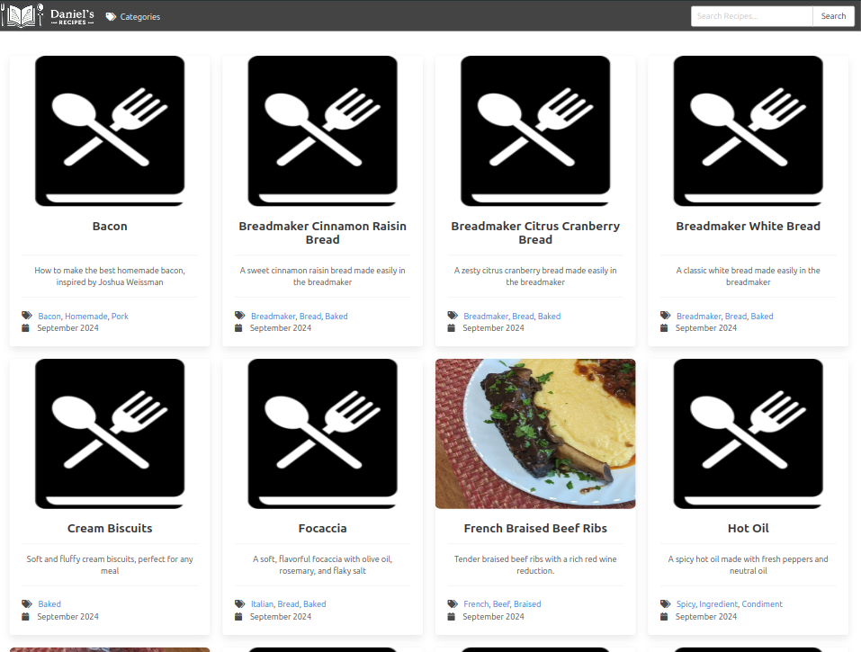
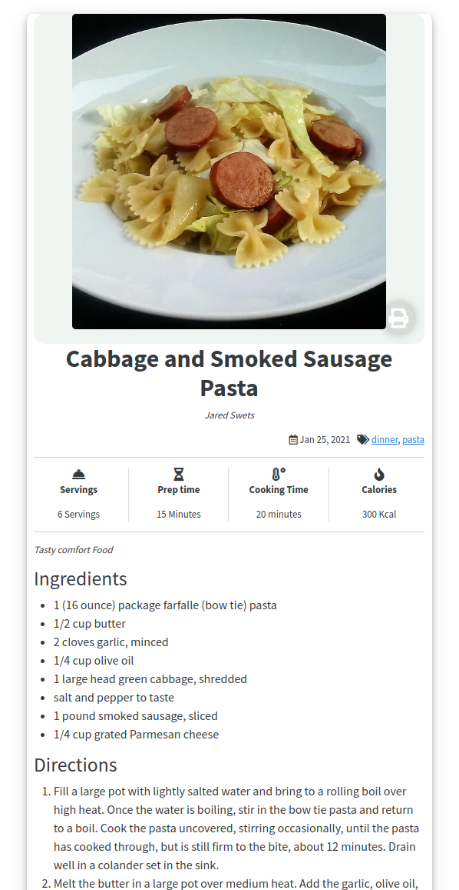
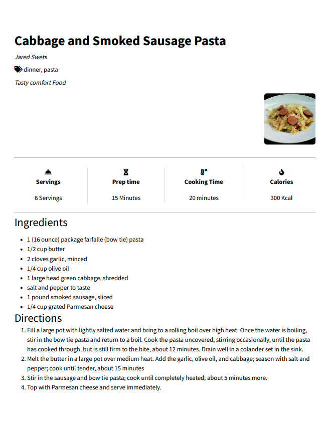
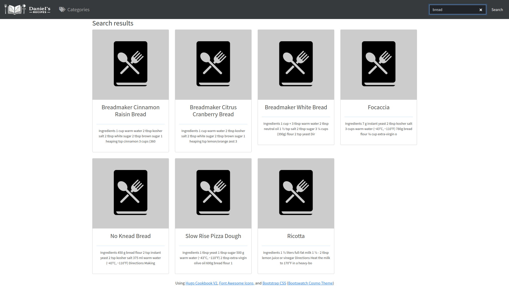

# Hugo Cookbook Theme V2

[Demo Site](https://hugo-cookbook-v2-example-site.netlify.app/)

## About

This is a theme for Hugo, based on the original [hugo-cookbook](https://github.com/deranjer/hugo-cookbook) that stores all of your recipes and displays them in a viewable format on desktop and mobile. This V2 theme now uses Bootstrap (with Bootswatch theme support).

Developed with Bootstrap 5 CSS and UmbrellaJS (as well as fuse.js for search).



## Features

- [x] Search all your recipes.
- [x] Display cooking/cooling time, calories, servings, and prep time.
- [x] Tag your recipes, browse by tags.
- [x] Break your ingredients into subheadings.
- [x] Print view.
- [x] 404 page.


## Install

### 1. Create a New Site
Start by creating a new site with Hugo. This will automatically generate the required folder structure (including `content`, `archetypes`, `static`, etc.).

```bash
hugo new site my-cookbook
cd my-cookbook
```

### 2. Install the Theme
Choose one of the following methods to install the theme:

#### Option A: Git Submodule (Recommended)
Initialize a git repository and add the theme as a submodule. This makes it easier to update the theme later.

```bash
git init
git submodule add https://github.com/dpasut/hugo-cookbook-v2.git themes/cookbook
```

#### Option B: Manual Download
If you prefer not to use git:
1. Download the latest code from the repository (Code -> Download ZIP).
2. Extract the zip file into your site's `themes/cookbook` directory.

## Configuration

1. **Copy the Config**: Copy the configuration file from `themes/cookbook/exampleSite/config.toml` to your site's root directory.
   ```bash
   cp themes/cookbook/exampleSite/config.toml hugo.toml
   ```
   *Note: Newer Hugo versions prefer `hugo.toml`, but `config.toml` works too.*

2. **Setup Archetypes**:
   Copy the default archetype to ensure new recipes are created correctly:
   ```bash
   cp themes/cookbook/archetypes/default.md archetypes/default.md
   ```

3. **Update Settings**:
   Edit `hugo.toml` (or `config.toml`) and update the `baseURL` to match your site's URL.

## Usage

Create a new recipe:
```bash
hugo new recipe-name.md
```

Start the server:
```bash
hugo server --disableFastRender
```

Visit `http://localhost:1313` to see your site.

## Troubleshooting

### "Unknown output format 'print'" Error
If you see an error like `failed to create config: unknown output format "print" for kind "page"`, it means your configuration file is likely outdated or incompatible with your Hugo version.

**Fix**: Ensure you have copied the latest `config.toml` from the `themes/cookbook/exampleSite/` directory to your site root. The theme requires specific output formats to be defined in your config file to handle the print view correctly.

### Missing Styles / Broken Layout
If the site loads but looks unstyled:
1. Check that your `baseURL` in `hugo.toml` matches the URL you are viewing (e.g., `http://localhost:1313/` for local development).
2. Ensure you are running `hugo server`.

## Recipe Views of the Site



## Print Views of the Site






### (Optional) Change Bootswatch theme

To change to a different Bootswatch theme, go to https://bootswatch.com/ and pick your desired theme. In `/themes/cookbook/layouts/partials/printhead.html` and `/themes/cookbook/layouts/partials/head.html`, change the Bootswatch CDN to your desired theme's CDN. For example:

```html
<link href="https://cdn.jsdelivr.net/npm/bootswatch@5.3.3/dist/cosmo/bootstrap.min.css" rel="stylesheet">
```

will become

```html
<link href="https://cdn.jsdelivr.net/npm/bootswatch@5.3.3/dist/quartz/bootstrap.min.css" rel="stylesheet">
```

It's as simple as that!
