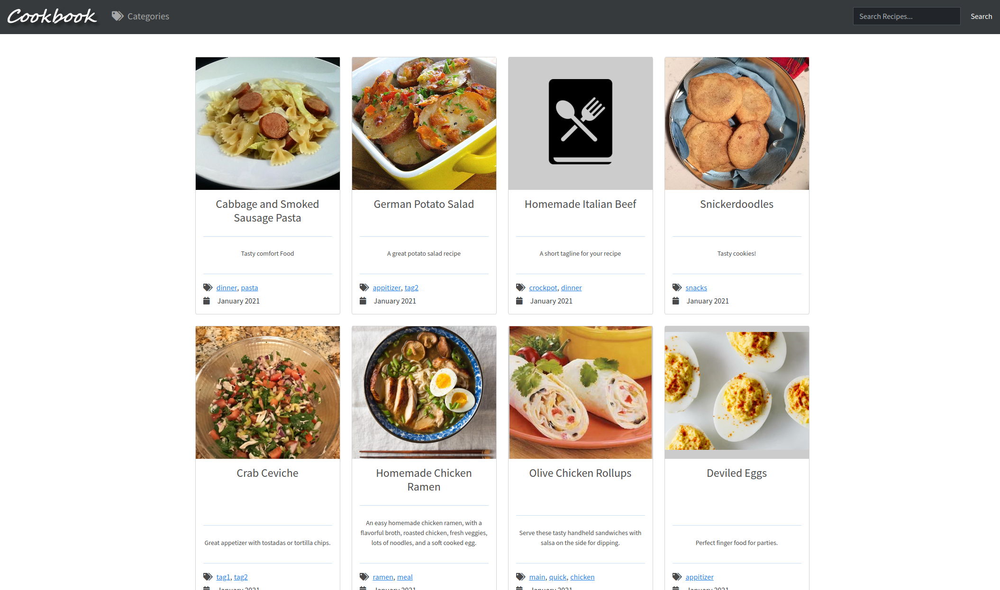
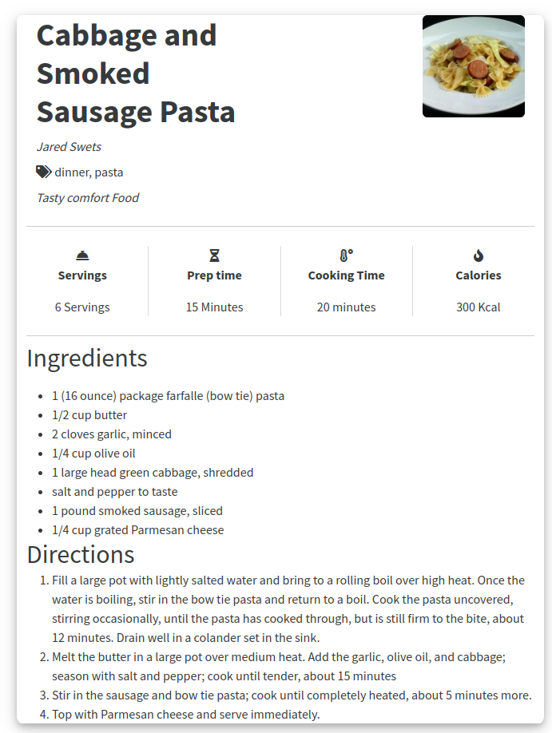
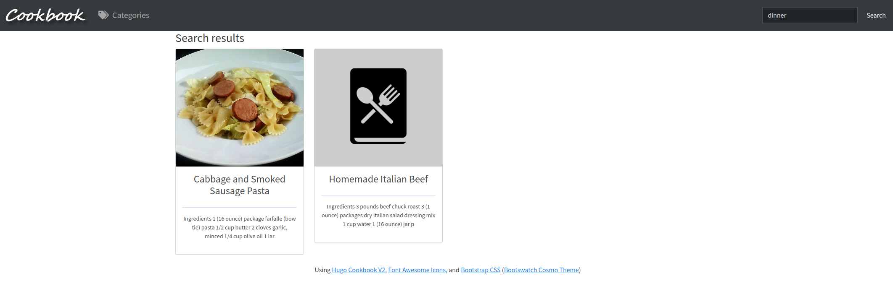

# Cookbook Theme

<!-- [Demo Site](https://wonderful-raman-ea1990.netlify.app) -->

## About

This is a theme for Hugo, based on the original [hugo-cookbook](https://github.com/deranjer/hugo-cookbook) that stores all of your recipes and displays them in a viewable format on desktop and mobile.

Developed with Bootstrap 5 CSS and UmbrellaJS (as well as fuse.js for search).



## Features

- [x] Search all your recipes.
- [x] Display cooking/cooling time, calories, servings, and prep time.
- [x] Tag your recipes, browse by tags.
- [x] Break your ingredients into subheadings.
- [x] Print view.
- [x] 404 page.


## Install

First create your site: `hugo new site <site_name>`

Then move into the directory: `cd <site_name>`

You can install using hugo's recommended theme install method while in your hugo site directory:

`git init`

`git submodule add https://github.com/deranjer/hugo-cookbook.git themes/cookbook`

OR

You can download the latest release, or the the current master as a zip, then extract the zip file into the themes directory.

## Copy Site Config

Then you can copy the `config.toml` from `exampleSite` to the root of your hugo directory, and modify that for your instance. You may need to name it `hugo.toml`, depending on the version of Hugo installed.

## Setup Default Template

Copy `default.md` from `themes/cookbook/archetypes/default.md` to `archetypes` and overwrite the current `default.md` in that directory.

This will ensure that any new content you create will be of type `recipe`.

## Change Bootswatch theme

To change to a different Bootswatch theme, go to https://bootswatch.com/ and pick your desired theme. In `/themes/cookbook/layouts/partials/printhead.html` and `/themes/cookbook/layouts/partials/head.html`, change the Bootswatch CDN to your desired theme's CDN. For example:

```
    <link href="https://cdn.jsdelivr.net/npm/bootswatch@5.3.3/dist/cosmo/bootstrap.min.css" rel="stylesheet">
```
will become
```
    <link href="https://cdn.jsdelivr.net/npm/bootswatch@5.3.3/dist/quartz/bootstrap.min.css" rel="stylesheet">
```
It's as simple as that!

## First Recipe

Simply run `hugo new recipe_name.md` to create your new recipe in the `content` folder.  Modify the markdown file as required for your new recipe.

`hugo server --disableFastRender` to view the site.

## Recipe Views of the Site


## Print Views of the Site



## Print Views of the Site


